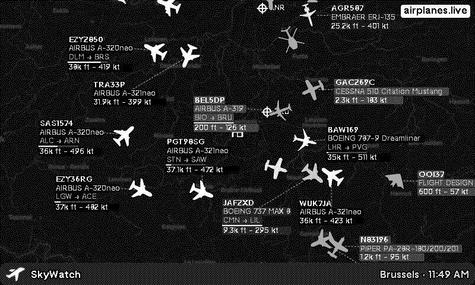
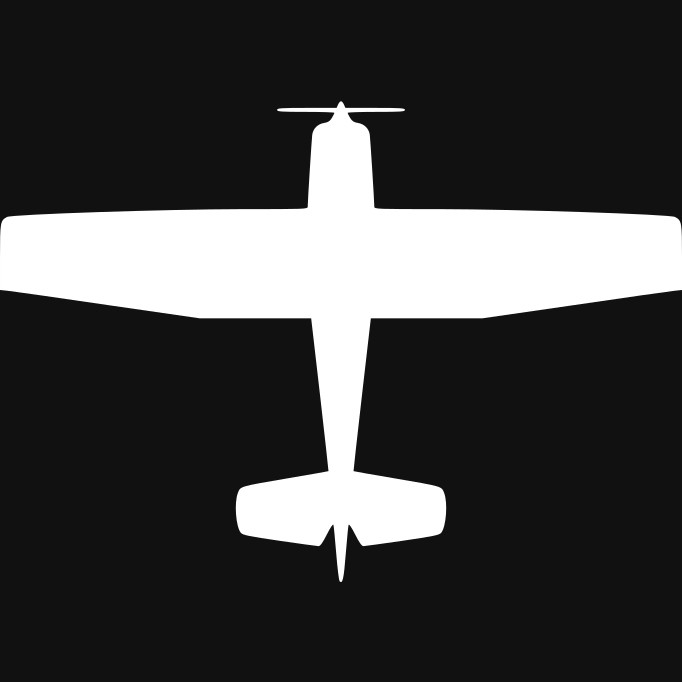
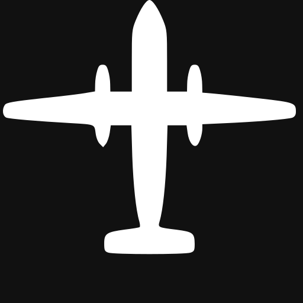
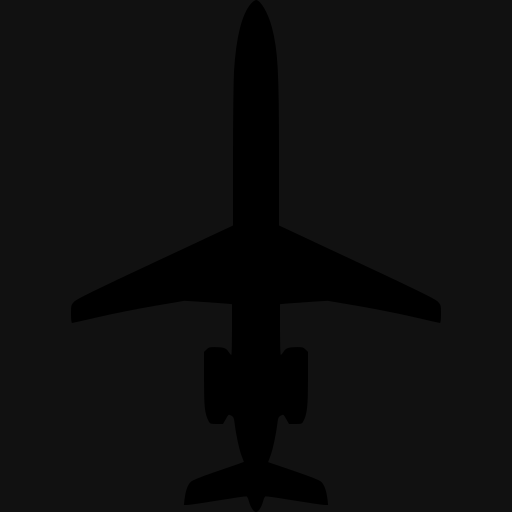
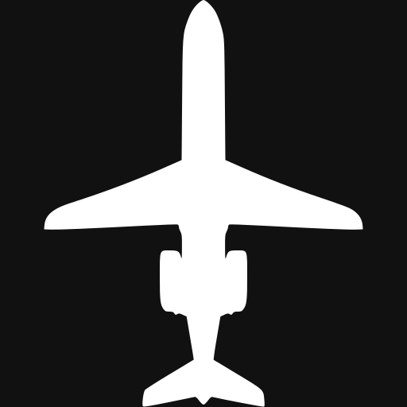
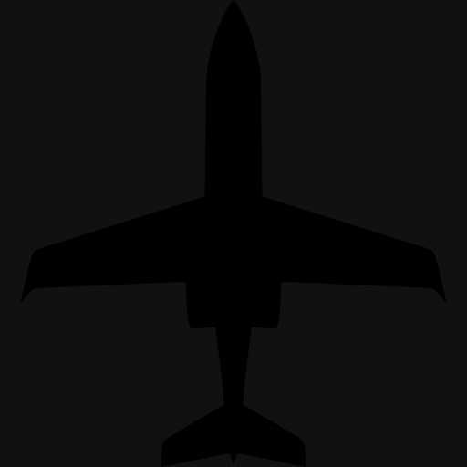
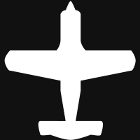
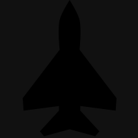

# trmnl-skywatch-plugin

<!-- PLUGIN_STATS_START -->
##  [SkyWatch](https://trmnl.com/recipes/286469)

 

### Description
Real-time aircraft radar on your TRMNL display. Live map updates every 15 minutes with all aircraft in a 50 nm radius. 36 type-specific icons — A320s, 747s, helicopters, gliders and more. Major airports marked on the map. Altitude shown by icon brightness and label shading. Emergency squawks (hijack · no radio · Mayday) flagged automatically.  Powered by <strong>airplanes.live</strong> · Icons by <a href="https://adsb-radar.com/" target="_blank">ADS-B Radar</a> · <a href="https://github.com/ExcuseMi/trmnl-skywatch-plugin/blob/main/ICONS.md" target="_blank">Icon guide</a>

---
<!-- PLUGIN_STATS_END -->

## Documentation

- [Aircraft Icon Reference](ICONS.md) — all aircraft icons, fallback categories, visual encoding guide, and titlebar icon options

## Aircraft Icons

Icons by [ADS-B Radar](https://adsb-radar.com/) — free SVG set used for on-map aircraft rendering.

### Specific Aircraft Types

| Icon | File | Aircraft |
|------|------|----------|
|  | `a320.svg` | Airbus A318 / A319 / A320 / A321 |
|  | `a330.svg` | Airbus A330 family |
|  | `a340.svg` | Airbus A340 family |
|  | `a380.svg` | Airbus A380 |
|  | `b737.svg` | Boeing 737 family |
|  | `b747.svg` | Boeing 747 family |
|  | `b767.svg` | Boeing 767 family |
|  | `b777.svg` | Boeing 777 family |
|  | `b787.svg` | Boeing 787 Dreamliner |
|  | `cessna.svg` | Cessna (C172, C152, C182, …) |
|  | `crjx.svg` | Bombardier CRJ family |
|  | `dh8a.svg` | Bombardier Dash 8 / Q-Series |
|  | `e195.svg` | Embraer E190 / E195 |
|  | `erj.svg` | Embraer ERJ-135 / 145 / 170 / 175 |
|  | `f100.svg` | Fokker 70 / 100 |
|  | `md11.svg` | McDonnell Douglas MD-11 |
|  | `glf5.svg` | Gulfstream G450 / G550 / G650 |
|  | `fa7x.svg` | Dassault Falcon 7X / 8X / 50 / 900 |
|  | `learjet.svg` | Learjet 35 / 45 / 55 / 60 |
|  | `c130.svg` | Lockheed C-130 Hercules / C-17 / C-5 |
|  | `f15.svg` | F-15 / F-16 / F-18 / F-22 / F-35 |
|  | `f5.svg` | Northrop F-5 |
|  | `f11.svg` | General Dynamics F-111 |

### ADS-B Emitter Category Fallbacks

Used when no specific type match is found. Based on the ADS-B `category` field broadcast by the aircraft.

| Icon | File | Category | Description |
|------|------|----------|-------------|
|  | `a0.svg` | A0 | No emitter category info |
|  | `a1.svg` | A1 | Light (< 15,500 lbs) |
|  | `a2.svg` | A2 | Small (15,500–75,000 lbs) |
|  | `a3.svg` | A3 | Large (75,000–300,000 lbs) |
|  | `a4.svg` | A4 | High vortex large (e.g. B757) |
|  | `a5.svg` | A5 | Heavy (> 300,000 lbs) |
|  | `a6.svg` | A6 | High performance (> 5g acceleration or > 400 kt) |
|  | `a7.svg` | A7 | Rotorcraft / helicopter |
|  | `b0.svg` | B0 | No emitter category info (non-motorised) |
|  | `b1.svg` | B1 | Glider / sailplane |
|  | `b3.svg` | B3 | Parachutist / skydiver |
|  | `b4.svg` | B4 | Ultralight / hang-glider / paraglider |
|  | `c0.svg` | C0–C3 | Surface vehicle / ground traffic |